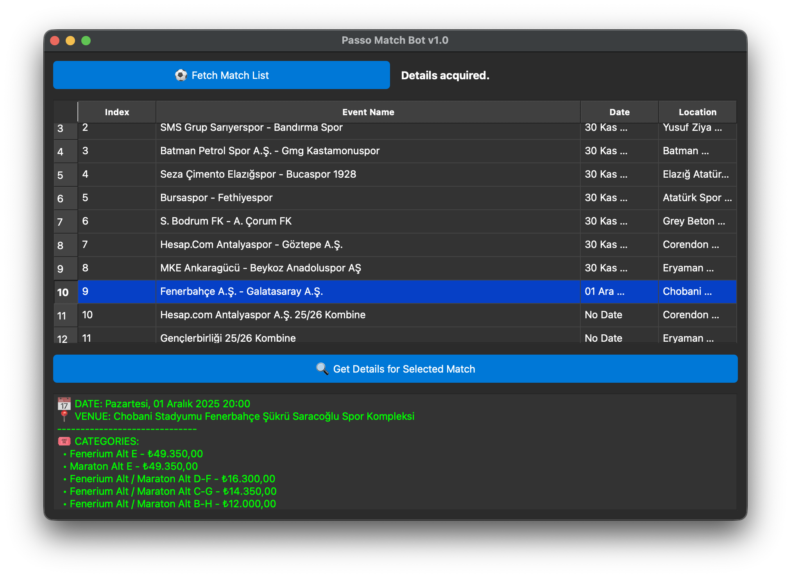

# ⚽ Passo Football Match Scraper



This project is a desktop-based automation application that scrapes football events from **Passo.com.tr**, lists them in a table, and fetches detailed information (venue, date, ticket categories) for selected matches.

Built using **Python**, **Selenium**, and **PySide6 (Qt)**. It features a modern, dark-themed graphical user interface (GUI).

---

## 🚀 Features

* **GUI (Graphical User Interface):** User-friendly interface built with PySide6.
* **Live Scraping:** Scrapes active football matches from Passo in real-time.
* **Detail Inspector:** Fetches specific details (Venue, Date, Ticket Categories) for any match selected from the list.
* **Asynchronous Operation:** Uses `QThread` (Multi-threading) to ensure the interface remains responsive while scraping runs in the background.
* **Anti-Bot Measures:** Selenium WebDriver is configured with custom User-Agents and automation flags to mimic real user behavior.
* **Headless Mode:** The browser runs in the background (invisible) by default for a seamless user experience.

## 🛠️ Tech Stack

* **[Python 3.10+](https://www.python.org/)**
* **[Selenium](https://www.selenium.dev/)**: For web automation and browser control.
* **[PySide6](https://doc.qt.io/qtforpython/)**: For the desktop GUI.
* **[BeautifulSoup4](https://www.crummy.com/software/BeautifulSoup/)**: For parsing HTML content.
* **[Pandas](https://pandas.pydata.org/)**: For data manipulation and table management.
* **WebDriver Manager**: For automatically managing Chrome drivers.

---

## ⚙️ Installation & Setup

Follow these steps to run the project on your local machine.

### 1. Prepare the Files
Ensure you have the following files in your project directory:
* `app.py` (Main application file)
* `seleniumDriver.py` (Driver configuration file)

### 2. Install Dependencies
Navigate to the project directory in your terminal and install the required libraries:

```bash
pip install selenium webdriver-manager PySide6 pandas beautifulsoup4
````

### 3\. Run the Application

Start the bot using Python:

```bash
python app.py
```

-----

## ▶️ How to Use

1.  When the application opens, click the **"⚽ Maç Listesini Getir" (Fetch Match List)** button.
2.  The bot will connect to Passo in the background and populate the table with current matches.
3.  Click on any row in the table to select a match.
4.  Click the **"🔍 Seçili Maçın Detaylarını Getir" (Get Selected Match Details)** button.
5.  Details regarding the date, venue, and ticket categories will appear in the text area at the bottom.

-----

## 📂 File Structure

```text
passo-match-bot/
│
├── app.py               # Main entry point, GUI, and Scraper Workers
├── seleniumDriver.py    # Selenium WebDriver configuration and options
└── README.md            # Project documentation
```

## ⚠️ Disclaimer

This software is developed solely for **educational and personal use**. The user is responsible for ensuring that their use of this tool does not violate Passo.com.tr's terms of service, cause harm to the website, or involve unauthorized commercial activity.
